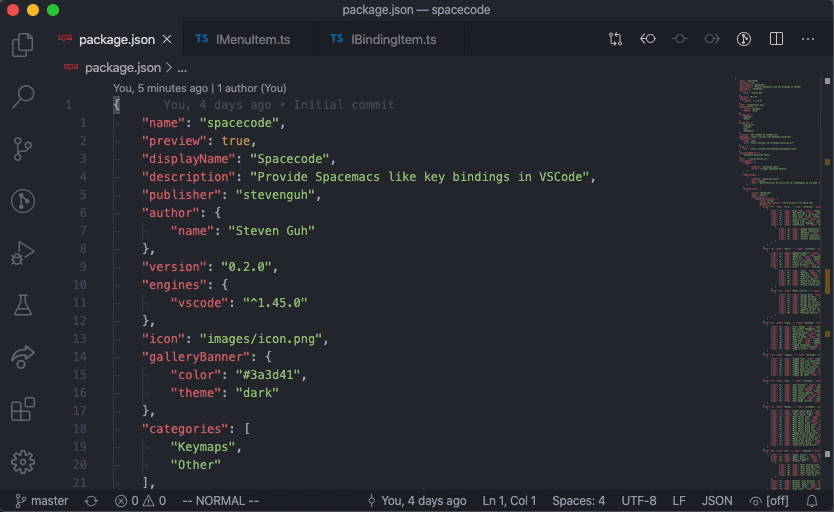

# VSpaceCode (Preview)


This extension is inspired by spacemacs and aiming to provide similar experience in VSCode. An action menu trigger by space key is implemented to reduce memorization of shortcuts. You can change the editor group, change the file language, and check git status without leaving your keyboard. This provides speed to shortcut while minimizing typing comparing to fuzzy search in the command palette or shortcut memorizing.

## Features

- Spacemacs like action menu to reduce memorization of shortcuts
- All menu items are customizable
- The menu key is customizable



## Requirements

- [VSCode Vim](https://marketplace.visualstudio.com/items?itemName=vscodevim.vim) (required for default space key)
- [GitLens](https://marketplace.visualstudio.com/items?itemName=eamodio.gitlens) (required for default bindings)
- [edamagit](https://marketplace.visualstudio.com/items?itemName=kahole.magit) and its Vim bindings (required for default bindings)

## Installation
After the installation of the extension, a series of prompts in the vscode notification will guide you through the steps to set to setup the key binding for the menu. If you are a VSCode Vim user, the prompts can config the space key in Vim key binding section automatically. However, it will reformat `vim.normalModeKeyBindingsNonRecursive` or `vim.visualModeKeyBindingsNonRecursive` in your `settings.json`. If you want to keep the format, or are not a vim users, you can follow the instructions below to add key bindings manually.

### I am using VSCode Vim
Add the menu key as follows in `settings.json`. This following example is to let VSCode Vim to capture the `space` key and trigger the action menu in normal mode and visual mode.
> To access `settings.json`, you can search `Setting` in the command list with `Ctl+Shift+P` or `Cmd+Shift+P` and select `Preference: Open Settings (JSON)`.

> If you have existing config for `vim.normalModeKeyBindingsNonRecursive` or `vim.visualModeKeyBindingsNonRecursive`, make sure you add to the array instead of replace them.

```json
"vim.normalModeKeyBindingsNonRecursive": [
  {
    "before": ["<space>"],
    "commands": ["vspacecode.space"]
  }
],
"vim.visualModeKeyBindingsNonRecursive": [
  {
    "before": ["<space>"],
    "commands": ["vspacecode.space"]
  }
]
```

### I am *not* using VSCode Vim
1. Change the `vspacecode.checkVimConfig` to `false` in `settings.json` disable vim config checking on startup.
2. Add the trigger as follows in `keybindings.json`. This following json is an example to bind `alt+space` to the action menu when a text editor is in focus.

> To access `keybindings.json`, you can search `Keyboard` in the command list with `Ctl+Shift+P` or `Cmd+Shift+P` and select `Preference: Open Keyboard Shortcuts (JSON)`.

```json
{
  "key": "alt+space",
  "command": "vspacecode.space",
  "when": "editorTextFocus"
},
```

## Menu Customization

There are two ways to customize the menu: incrementally, and from scratch. Incrementally is great for when you only need to modify a few bindings from the default. Customizing from scratch is great for total control and the customization.

> The key `q` is reversed to escape the menu.

> The default bindings are subject to change before `1.0.0`. If you find something you that think it should bind to a particular key by default, or you want a particular command, please open an issue as a feature request.

### Incrementally
Using this option will allow to you surgically update the default bindings (`vspacecode.bindings`). The extension will override bindings sequentially base on `vspacecode.bindingOverrides`.

#### Add/Replace
The following json will replace `<SPC> g s` in the same position if the binding exists in `vspacecode.bindings`, and append `s` to menu `<SPC> g` if it doesn't exists. This override will only execute if `<SPC> g` menu exists. An optional `position` key can be used to specified index of where the item should be inserted/moved to.

```jsonc
{
  "vspacecode.bindingOverrides": [
    {
      "keys": "g.s",
      "name": "Go to line",
      "type": "command",
      "command":"workbench.action.gotoLine",
    }
  ]
}
```
The following example will replace/append the whole `<SPC> g` menu with one binding `s` in it.
```jsonc
{
  "vspacecode.bindingOverrides": [
    {
      "keys": "g",
      "name": "Go...",
      "type": "bindings",
      "bindings": [
        {
          "key": "s",
          "name": "Go to",
          "type": "command",
          "command": "workbench.action.gotoLine",   
        }
      ]
    }
  ]
}
```
If the key binding's key uses character `.` like `<SPC> e .`, you can target that by using an array in the keys like `"keys": ["e", "."]`.

#### Removal
Any negative number in position is denoting a removal operation. In the following example, any item bound to `<SPC> g s` will be remove.
```jsonc
{
  "vspacecode.bindingOverrides": [
    {
      "keys": "g.s",
      "position": -1,
    }
  ]
}
```

### From Scratch
To customize the menu items from scratch, you can override the menu completely by putting your own `vspacecode.bindings` into your `settings.json`. Using this option will prevent any update to your own bindings.

An example of a `settings.json` file that overrides space menu is as follows:
```json
{
  "vspacecode.bindings": [
    {
      "key": "f",
      "name": "File...",
      "type": "bindings",
      "bindings": [
        {
          "key": "f",
          "name": "Open file",
          "type": "command",
          "command": "workbench.action.files.openFileFolder"
        },
        {
          "key": "i",
          "name": "Indentation...",
          "type": "bindings",
          "bindings": [
            {
              "key": "i",
              "name": "Change indentation",
              "type": "command",
              "command": "changeEditorIndentation"
            },
            {
              "key": "d",
              "name": "Detect indentation",
              "type": "command",
              "command": "editor.action.detectIndentation"
            }
          ]
        }
      ]
    }
  ]
}
```

The default value can be found in the `contributes.configuration.vspacecode.bindings.default` section of the `package.json` in this repo. You can use the default value as an example to craft your own custom menu.

## Release Notes

See [CHANGELOG.md](CHANGELOG.md)

## Contribution
All feature requests and help are welcome. Please open an issue to track.

## Credits
Thanks @kahole for his implementation of quick pick menu in edamagit.